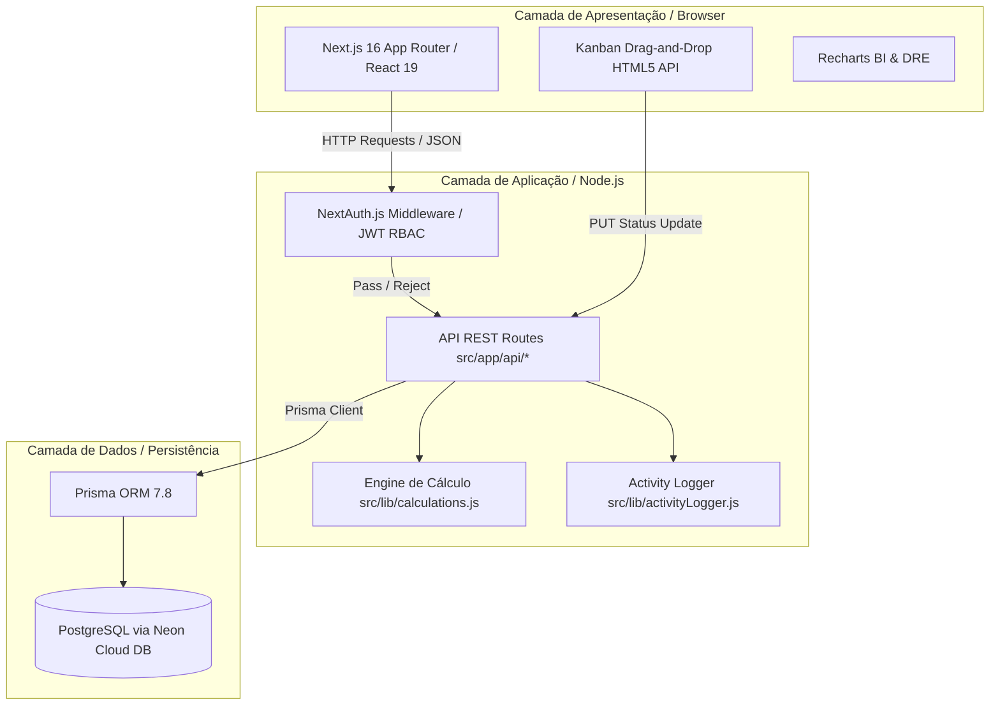
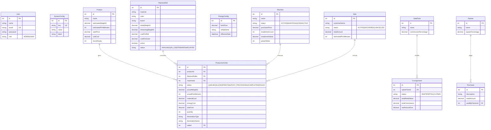

# 📘 Documentação Técnica Completa — Solyd3D ERP & MES

A presente documentação descreve em nível de engenharia de software toda a arquitetura, modelos de dados, endpoints de API, fluxos de negócio, algoritmos de cálculo e componentes de interface do **Solyd3D**, o ERP e Sistema de Execução de Manufatura (MES) desenvolvido especificamente para operações profissionais de impressão 3D FDM.

---

## 🏗️ 1. Arquitetura de Software & Stack Tecnológica

O Solyd3D é construído sob uma arquitetura web moderna, escalável e segura, separada em camadas coesas:



### 1.1 Detalhamento Tecnológico
- **Runtime & Framework:** Node.js + Next.js 16.2.10 (App Router, Server & Client Components).
- **Linguagem:** JavaScript (com JSDoc e tipagem inferida).
- **Persistência de Dados:** PostgreSQL hospedado no Neon Cloud, acessado via `Prisma ORM 7.8.0` (`@prisma/client` e `@prisma/adapter-pg`).
- **Segurança & Identidade:** `NextAuth v4` (`src/middleware.js`) protegendo todas as rotas com tokens JWT e role-based access control (`ADMIN` vs `USER`). Senhas de usuários são hashadas usando `bcryptjs`.
- **UI & Estilização:** Design system próprio em Vanilla CSS (`src/app/globals.css`) utilizando variáveis CSS raiz (Design Tokens), temas escuros de alta fidelidade (Dark Theme), Glassmorphism, animações por keyframe e ícones SVG via `lucide-react`.

---

## 🗄️ 2. Modelo de Dados Completo (Schema ER & Tabelas)

O banco de dados é modelado no `prisma/schema.prisma` e estruturado em 12 entidades centrais e 5 enumerações:



### 2.1 Especificação Detalhada de Modelos & Campos-Chave

#### 📌 `SystemConfig` (Tabela `system_configs`)
Armazena chaves-valores para flags dinâmicas do sistema sem necessidade de redeploy:
- `key` (String, Unique): Identificador da configuração (ex: `modo_estoque_granular`).
- `value` (String): Valor persistido (ex: `"true"` ou `"false"`).
- `label` (String): Descrição legível para exibição nas telas administrativas.

#### 📌 `FilamentRoll` (Tabela `filament_rolls`)
Almoxarifado de matéria-prima (rolos de filamento FDM):
- `initialWeightG` (Decimal): Peso original de fábrica do rolo em gramas (geralmente 1000g).
- `remainingWeightG` (Decimal, Nullable): Saldo atual do rolo em gramas. Utilizado exclusivamente quando o `modo_estoque_granular` está ativo (`true`).
- `costPerRoll` (Decimal) & `costPerGram` (Decimal): Custo total de aquisição e custo unitário derivado ($custo/g = \frac{costPerRoll}{initialWeightG}$).
- `active` (Boolean): Flag que determina se o filamento aparece nos seletores de ordens de produção. Desativado automaticamente se o saldo zerar.

#### 📌 `ProductionOrder` (Tabela `production_orders`)
Coração do módulo de manufatura (Kanban):
- `status` (`OrderStatus` Enum): `QUEUED` (Na Fila), `SLICED` (Fatiado), `PRINTING` (Imprimindo), `POST_PROCESSING` (Pós-Processamento), `COMPLETED` (Concluído), `FAILED` (Falha/Scrap).
- `actualWeightG` (Decimal) & `actualPrintMinutes` (Int): Apontamentos reais coletados no momento em que a ordem é finalizada ou registrada como falha.
- `materialCost`, `energyCost`, `totalCost` (Decimal): Valores financeiros calculados e congelados no encerramento da OP.
- `destinationType` & `destinationName`: Indica se a peça destina-se a `DIRECT_SALE` (Venda Avulsa), `ORDER` (Encomenda) ou `SALES_POINT` (Ponto de Venda).
- `saleId` & `saleItemId`: Vínculo de chave estrangeira com a venda ou item de venda que gerou esta produção.

#### 📌 `Partner`, `Purchase` & `PurchaseSplit`
Módulo de suprimentos societários:
- `Partner.equityPercentage`: Cota parte de cada sócio na empresa (a soma totaliza 100%).
- `Purchase.paidByPartnerId`: Identifica qual sócio desembolsou o valor da compra.
- `PurchaseSplit`: Tabela associativa que especifica quanto cada sócio deve arcar daquela compra em específico.

---

## ⚡ 3. Regras de Negócio Core & Fórmulas Matemáticas

O sistema isola as regras de cálculo e transformações matemáticas em `src/lib/calculations.js`, garantindo padronização entre as rotas de API e as interfaces de usuário.

### 3.1 Engenharia de Custos de Impressão 3D
Quando uma Ordem de Produção é apontada como `COMPLETED` ou `FAILED`, ou quando uma simulação é rodada na `Calculadora`, o sistema calcula 3 componentes:

1. **Custo de Matéria-Prima ($C_{mat}$):**
   $$C_{mat} = \text{peso utilizado (g)} \times \text{quantidade de peças} \times C_{grama}$$
   Onde $C_{grama} = \frac{\text{Custo do Rolo (R\$)}}{\text{Peso Inicial do Rolo (g)}}$.

2. **Custo de Energia Elétrica ($C_{en}$):**
   $$C_{en} = \left(\frac{\text{Potência da Máquina (W)}}{1000}\right) \times \left(\frac{\text{Tempo de Impressão (min)}}{60}\right) \times \text{Tarifa de Energia (R\$/kWh)}$$
   *Nota: A tarifa de energia consultada pelo sistema é sempre o registro mais recente (maior `effectiveDate`) da tabela `EnergyConfig`.*

3. **Custo Total de Fabricação ($C_{total}$):**
   $$C_{total} = C_{mat} + C_{en}$$

---

### 3.2 Chave de Estoque Granular (Toggle Lógico no Backend)
No endpoint `PUT /api/production-orders` (responsável pelas movimentações no Kanban), existe uma bifurcação condicional baseada no status da flag `modo_estoque_granular`:

```javascript
// Algoritmo de Baixa de Almoxarifado implementado no PUT /api/production-orders
const granularConfig = await prisma.systemConfig.findUnique({ where: { key: 'modo_estoque_granular' } });
const isGranular = granularConfig?.value === 'true';

if (status === 'COMPLETED' || status === 'FAILED') {
  // 1. Apura custos (materialCost, energyCost, totalCost) em AMBOS os modos
  // ...

  // 2. Bifurcação Granular vs Simplificado
  if (isGranular && existingOrder.filamentRoll) {
    const totalWeightToSubtract = weightUsed * qty;
    const currentRemaining = Number(existingOrder.filamentRoll.remainingWeightG ?? existingOrder.filamentRoll.initialWeightG);
    const newRemaining = Math.max(0, currentRemaining - totalWeightToSubtract);

    await prisma.filamentRoll.update({
      where: { id: existingOrder.filamentRollId },
      data: {
        remainingWeightG: newRemaining,
        status: determineFilamentStatus(newRemaining), // AVAILABLE, IN_USE, ou FINISHED (if <= 0)
        active: newRemaining > 0, // Desativa automaticamente o filamento se o saldo zerar
      },
    });
  }
  // Se !isGranular (Modo Simplificado): Nenhuma alteração ocorre no saldo em gramas ou no status do rolo de filamento.
}
```

---

### 3.3 Gatilho Reverso de Venda Automática (`POST /api/production-orders`)
Para eliminar esquecimentos de faturamento na fábrica, quando o operador cria uma Ordem de Produção (`POST`) informando que o destino é `DIRECT_SALE` (Venda Direta) ou `ORDER` (Encomenda) para um determinado cliente (`destinationName`), **mas sem atrelar a um ID de venda pré-existente (`saleId === null`)**, o backend executa uma transação automática:

1. Busca o preço sugerido do produto no catálogo (`salePrice`).
2. Cria automaticamente um novo registro na tabela `Sale` com status `ACTIVE` no nome do cliente informado.
3. Cria o item correspondente (`SaleItem`) com a quantidade de peças da OP.
4. Salva o `reverseSale.id` como `saleId` da nova Ordem de Produção.
*Resultado: Ao acessar a aba de Vendas, a cobrança já estará criada aguardando o pagamento do cliente.*

---

### 3.4 Motor de Netting Societário (`GET /api/purchases/netting`)
O acerto de contas entre os sócios/parceiros da fábrica 3D é resolvido pelo algoritmo de compensação (Netting) em `/api/purchases/netting`:

1. Identifica todos os sócios e suas respectivas cotas societárias (`equityPercentage`).
2. Soma todas as despesas da tabela `Purchase` no mês ou período selecionado (`totalExpenses`).
3. Para cada sócio $i$, calcula seu **Valor Devido Ideal ($D_i$)**:
   $$D_i = \text{totalExpenses} \times \left(\frac{\text{equityPercentage}_i}{100}\right)$$
4. Soma o **Valor Real Desembolsado ($P_i$)** por cada sócio nas notas fiscais (`paidByPartnerId == partner.id`).
5. Calcula o **Saldo Líquido ($S_i$)**:
   $$S_i = P_i - D_i$$
   - Se $S_i > 0$: O sócio pagou mais do que sua obrigação societária (é um **credor**).
   - Se $S_i < 0$: O sócio pagou menos do que sua obrigação societária (é um **devedor**).
6. O algoritmo gera uma lista de **Transferências Sugeridas (`transfers`)**, conectando exatamente qual sócio devedor deve fazer um PIX/transferência para qual sócio credor para que todas as contas empatem perfeitamente em $0,00$.

---

## 🌐 4. Mapeamento Completo de Endpoints REST (`/api/*`)

Abaixo estão documentadas todas as 15 rotas de API REST servidas pelo backend Node.js (`src/app/api/*`):

| Endpoint | Métodos | Descrição | Regras de Negócio Principal |
| :--- | :---: | :--- | :--- |
| `/api/production-orders` | `GET`, `POST`, `PUT`, `DELETE` | Gestão do Kanban e Ordens de Produção | Executa o Gatilho Reverso no `POST` e a Baixa Condicional Granular + Cálculo de Custos no `PUT`. |
| `/api/system-config` | `GET`, `PUT` | Configurações Globais | Inicializa e altera chaves como `modo_estoque_granular`. Grava log em `ActivityLog`. |
| `/api/products` | `GET`, `POST`, `PUT`, `DELETE` | Catálogo de Peças 3D | Controla tempos/pesos padrão, custos de referência e saldo de estoque pronto (`stockReady`). |
| `/api/filament-rolls` | `GET`, `POST`, `PUT`, `DELETE` | Almoxarifado de Filamentos | Gerencia marcas, cores, saldo inicial/restante e flags `is_active`. |
| `/api/machines` | `GET`, `POST`, `PUT`, `DELETE` | Parque de Impressoras 3D | Registra potência (`Watts`), valor de aquisição, depreciação e status operacional. |
| `/api/energy-config` | `GET`, `POST` | Histórico de Tarifas Elétricas | Salva tarifas em `R$/kWh` e vigência para cálculo dinâmico de custo elétrico. |
| `/api/sales` | `GET`, `POST`, `PUT`, `DELETE` | Vendas e Encomendas | Consolida itens vendidos, status (`ACTIVE/DELIVERED`) e cálculos de faturamento. |
| `/api/sales-points` | `GET`, `POST`, `PUT`, `DELETE` | Pontos de Venda Cadastrados | Comércios parceiros para consignação e comissão percentual combinada. |
| `/api/consignments` | `GET`, `POST`, `PUT`, `DELETE` | Lotes em Consignação | Gerencia remessas (`SENT/CLOSED`), peças vendidas/devolvidas e valor líquido a receber. |
| `/api/supplies` | `GET`, `POST`, `PUT`, `DELETE` | Suprimentos & Insumos | Peças de reposição da fábrica (bicos, mesas PEI, álcool, embalagens). |
| `/api/purchases` | `GET`, `POST`, `PUT`, `DELETE` | Compras e Notas Fiscais | Registra despesas com insumos e atrela ao sócio pagador. |
| `/api/purchases/splits` | `GET`, `POST`, `DELETE` | Divisão de Compras | Especifica rateios personalizados de compras entre sócios. |
| `/api/purchases/netting`| `GET` | Acerto Societário (Netting) | Roda o algoritmo de compensação societária e sugere transferências financeiras. |
| `/api/users` | `GET`, `POST`, `PUT`, `DELETE` | Gestão de Usuários (RBAC) | **Acesso restrito a `ADMIN` via middleware**. Gerencia senhas (`bcryptjs`) e cargos. |
| `/api/activity-logs` | `GET` | Trilha de Auditoria | Consulta histórico cronológico de todas as ações de usuários no sistema. |

---

## 🖥️ 5. Componentes & Fluxos de Interface (`src/app/*`)

O frontend é construído sob o padrão de **App Router** do Next.js 16, combinando Server Components (onde aplicável) com Client Components interativos (`'use client'`).

### 5.1 `src/app/producao/page.js` — O Kanban de Produção
O módulo visual mais avançado do sistema:
- **Quadro de 6 Colunas (`.kanban-board` / `.kanban-column`):** Cada coluna (`Na Fila`, `Fatiado`, `Imprimindo`, `Pós-Processamento`, `Concluído`, `Falha`) possui cor de realce própria definida em CSS e contador dinâmico de cartões.
- **Drag-and-Drop HTML5 Nativo:** Implementado sem bibliotecas externas pesadas. Cartões (`.kanban-card`) utilizam `onDragStart`, `onDragEnd` e as colunas monitoram `onDragOver` (aplicando highlight `.drag-over`) e `onDrop`.
- **Efeitos Visuais de Estado:** Cartões na coluna "Imprimindo" (`PRINTING`) recebem a classe CSS `.printing-pulse`, que renderiza uma barra superior em gradiente animado (`@keyframes pulseGlow`), simulando a impressora em atividade em tempo real.
- **Card Rico em Dados (`<KanbanCard />`):** Exibe simultaneamente: ID da OP, Nome e Quantidade da Peça, Destino/Cliente (`MapPin`), Impressora designada (`Printer`), Saldo de gramas restantes no rolo (`Package`, visível no modo granular), Badge do Filamento/Cor, Venda vinculada (`🛍️ #ID`, clicável e redirecionável para `/vendas`) e custos apurados (em verde para concluídas e vermelho em caso de prejuízo por falha).
- **Modais de Apontamento:** Ao soltar um card em `COMPLETED` ou `FAILED`, o modal bloqueia a transição até que o operador insira o peso e tempo reais. O modal exibe um alerta dinâmico (`alert-info`) indicando claramente se o Estoque Granular está **LIGADO** (subtraindo gramas) ou **DESLIGADO** (simplificado).

---

### 5.2 `src/app/configuracoes/page.js` — Chave Global & Máquinas
- **Card de Toggle Premium (`.config-toggle-card`):** Exibido no topo da tela de configurações. Contém um switch animado (`.toggle-switch` / `.toggle-slider`). Ao clicar, dispara `PUT /api/system-config` com `{ key: 'modo_estoque_granular', value: !current }`. A interface reage instantaneamente mudando a cor (Verde Esmeralda para Ativado vs Cinza para Desativado) e reescrevendo o texto explicativo das regras de negócio.
- **Grids de Cadastro:** Divisão em 2 colunas permitindo adicionar, inspecionar e remover Impressoras 3D (`/api/machines`) e adicionar novas Tarifas de Energia (`/api/energy-config`).

---

### 5.3 `src/app/calculadora/page.js` — Precificador Orçamentário
- Interface dividida em painel de entrada (onde o operador digita o peso do fatiador, tempo, escolhe filamento e máquina) e painel de resultados (um cartão estilo recibo detalhando custo de material, custo de energia, desgaste da máquina, custo base e preço final sugerido com base na margem de lucro % informada).

---

### 5.4 `src/app/vendas/page.js` & `src/app/vendas/pontos/page.js`
- **Vendas Diretas (`/vendas`):** Listagem de pedidos, totalizadores de receita, filtro por status (`ACTIVE/DELIVERED/CANCELLED`) e modal de nova venda com adição múltipla de itens do catálogo.
- **Pontos de Venda & Consignação (`/vendas/pontos` e `/remessas`):** Painéis de controle que calculam automaticamente a comissão retida pela banca/loja parceira e geram o relatório de fechamento de lote quando o parceiro presta contas das peças vendidas.

---

### 5.5 `src/app/compras/page.js` — Suprimentos & Netting
- Exibe em abas separadas o estoque de insumos/peças de reposição (`SupplyItem`) e o extrato de notas fiscais de compra (`Purchase`).
- O painel de **Acerto entre Sócios (Netting)** renderiza em cards visuais o saldo devedor ou credor de cada sócio e exibe as caixas de transferência PIX sugeridas pelo algoritmo de compensação para fechar o mês.

---

### 5.6 `src/app/financeiro/page.js` — DRE & BI
- Painel executivo que consolida todas as entradas e saídas.
- Renderiza gráficos de barras e pizza interativos via `Recharts`, dividindo custos por categoria (Filamentos vs Energia vs Fixos vs Variáveis) e apresentando o demonstrativo de resultado operacional do período.

---

## 🔒 6. Segurança, Autenticação & Trilha de Auditoria

### 6.1 Interceptor Middleware (`src/middleware.js`)
O arquivo `src/middleware.js` intercepta 100% das requisições HTTP recebidas pelo Next.js (exceto arquivos estáticos e imagens `_next/static`):
1. Verifica a existência e validade do token JWT de autenticação (`withAuth`).
2. Se o usuário tentar acessar qualquer rota do ERP sem estar autenticado, é redirecionado para `/login`.
3. Se um usuário logado tentar acessar `/login`, é redirecionado para o Dashboard `/`.
4. **Controle de Acesso por Cargo (RBAC):** Se a requisição for direcionada para a tela de usuários (`/usuarios`) ou para a API de gestão de usuários (`/api/users`), o middleware verifica se `token.role === 'ADMIN'`. Caso contrário, a requisição é bloqueada imediatamente com status `403 Forbidden` antes de atingir o servidor de rotas.

### 6.2 Trilha de Auditoria (`src/lib/activityLogger.js`)
Qualquer transação sensível realizada pelo usuário (ex: criar OP, concluir peça, alterar chave de estoque, cadastrar máquina, excluir registro) invoca o utilitário assíncrono `logAction`:

```javascript
// Exemplo de invocação em src/app/api/system-config/route.js
await logAction({
  actionType: 'ATUALIZAR',
  module: 'CONFIGURACOES',
  description: `Alterou configuração "modo_estoque_granular" para: LIGADO (Granular — Subtrai gramas)`,
});
```
Isso grava um registro permanente na tabela `activity_logs` contendo o ID do usuário (obtido via sessão/header), o timestamp exato, o tipo de ação (`CRIAR`, `ATUALIZAR`, `EXCLUIR`, `CONCLUIR`) e o módulo afetado, garantindo total governança e rastreabilidade na operação da fábrica 3D.
